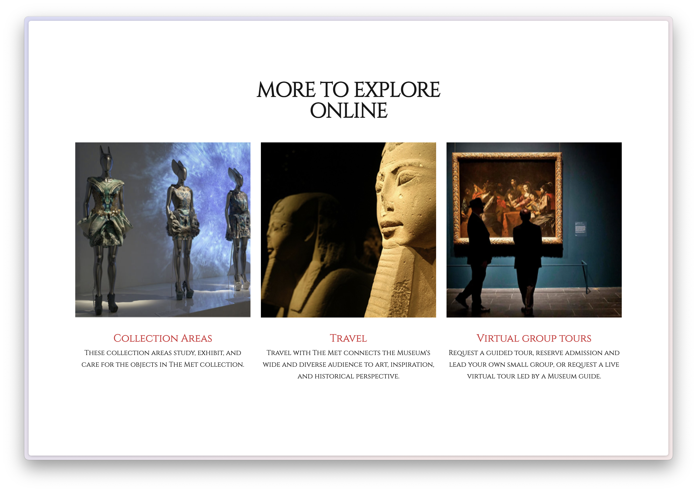

# 🏛️ TheMET

A web-site showcasing **ancient artworks** — a virtual art museum built as a static site.

---

## 🔗 Live Preview

👉 [**Explore TheMET online →**](https://aiiyuu.github.io/TheMET/)

---

## 🎨 Design Reference

This project’s visual style is inspired by **The Metropolitan Museum of Art’s ancient collection**.
The layout is built using a responsive **CSS Grid** system powered by SCSS mixins such as:

* `on-tablet`
* `on-desktop`
* `hover()`
* `page-grid`

These define breakpoints, hover transitions, and dynamic column layouts.

### ✨ Key Visual Principles

* 🖋️ **Classical typography** using the *Cinzel* serif font
* 🌑 **Dark museum-themed palette** (`#161616`, `#d12d35`)
* 🧩 **Adaptive grid layouts** on tablet and desktop
* 🖱️ **Smooth hover transitions** using the `hover()` mixin
* 🏛️ **12-column responsive grid** for a refined gallery look

These combined elements recreate a polished, museum-like viewing experience ideal for showcasing ancient art.

---

## 🖼️ Images & Screenshots



---

## 🛠️ Technologies Used

* 🌐 **HTML**
* 🎨 **Sass (SCSS)**
* ⚙️ **JavaScript**
* 🚀 **GitHub Pages** for static hosting

---

## 🚀 Getting Started

1. **Clone the repository**

   ```bash
   git clone https://github.com/aiiyuu/TheMET.git
   ```

2. **Navigate into the project folder**

   ```bash
   cd TheMET
   ```

3. **Install dependencies**

   ```bash
   npm install
   ```

4. **Start the local development server**

   ```bash
   npm run start
   ```
